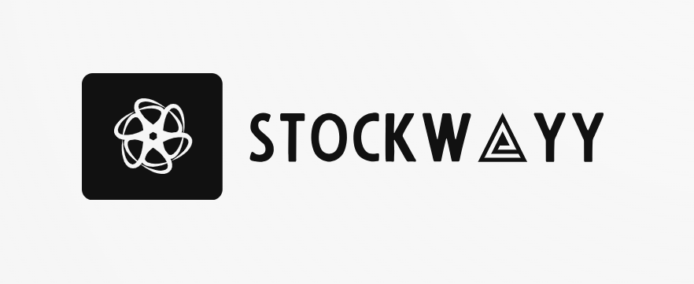
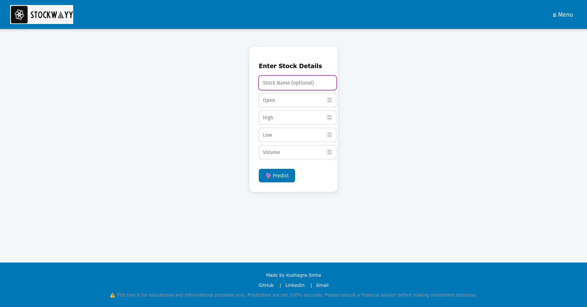
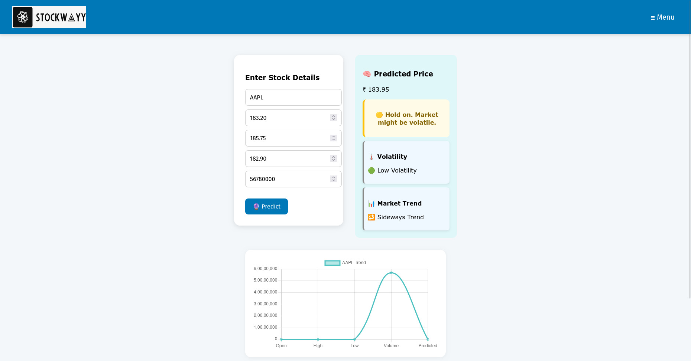

# 📈 StockWayy – Stock Predictor Dashboard

StockWayy is a smart stock prediction web application that empowers users to analyze trends, view visual insights, and make data-driven investment decisions. It features ML-powered forecasts, sleek design, and useful integrations to enhance your market strategy.

---

## 🚀 Features

- 🔮 **Stock Price Prediction:** Get predicted stock prices based on historical data and algorithms.
- 🌗 **Dark/Light Mode:** Toggle between dark and light themes for a comfortable user experience.
- 📊 **Chart Visualizations:** View stock trends with interactive charts.
- 📈 **Volatility & Trend Analysis:** View stock volatility and trend indicators.
- 💡 **AI-based Recommendations:** Get stock recommendations based on predictions and analysis.
- 📅 **Google Calendar Integration:** Schedule stock alerts or reminders using Google Calendar.

---

## 🛠️ Tech Stack

| Layer        | Technologies                      |
|-------------|-----------------------------------|
| **ML Model** | Used Linear Regression to achieve 99.2% testing accuracy.         |
| **Frontend** | React.js, HTML5, CSS3              |
| **Backend**  | Node.js, Express.js                |
| **Charts**   | Chart.js, D3.js                    |
| **Other**    | Google Calendar API, Theme Toggle |

---

## 📸 Screenshots




---

## 🧪 Installation

### 📋 Prerequisites

- [Node.js](https://nodejs.org/) (v14+)
- [Git](https://git-scm.com/)

### 🧰 Setup

```bash
# Clone the repo
git clone https://github.com/kushfs/stockwayy.git
cd stockwayy

# Install dependencies
npm install

# Start the app
npm start

